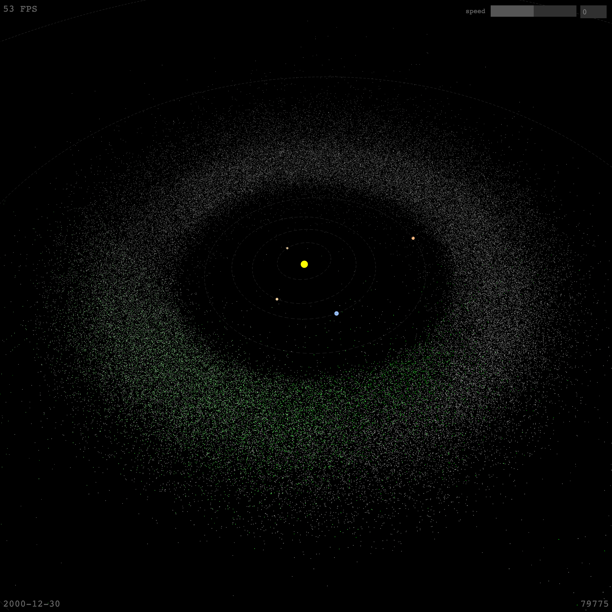

# Orrery3D

**✨ This is a 3D port of [Orrery](https://github.com/sn3p/Orrery) (2D).**

[Visualization](https://sn3p.github.io/Orrery3D) showing the orbits of [minor planets](https://en.wikipedia.org/wiki/Minor_planet) and their discovery over time.

Two daily updated datasets are used to extract the orbital elements and discovery circumstances of minor planets. The data used is maintained by [The Minor Planet Center (MPC)](https://minorplanetcenter.net/):

- [The MPC Orbit (MPCORB) Database](https://minorplanetcenter.net/iau/MPCORB.html) Database containing orbital elements of minor planets.
- [NumberedMPs.txt](http://www.minorplanetcenter.net/iau/lists/NumberedMPs.txt) Discovery circumstances of the minor planets.

## How to use

Install dependencies:

```bash
npm install
```

Start server:

```bash
npm run serve
```

Build and bundle:

```bash
npm run build
```

Watch changes and rebuild:

```bash
npm run watch
```

Deploy to gh-pages:

```bash
npm run deploy
```

## Get updated data

Data files are stored in the `data` directory.
You can either download the data files manually using the links above, or use the download script:

Download the data and parse it to JSON:

```bash
cd data
./download_data.sh && ./data_to_json.py
```

There are over 500k results, so the output JSON file will be rather large and will be heavy to render. You can limit the maximum amount of results by passing a number as an argument:

```bash
./data_to_json.py 9999
```

## Screenshot


