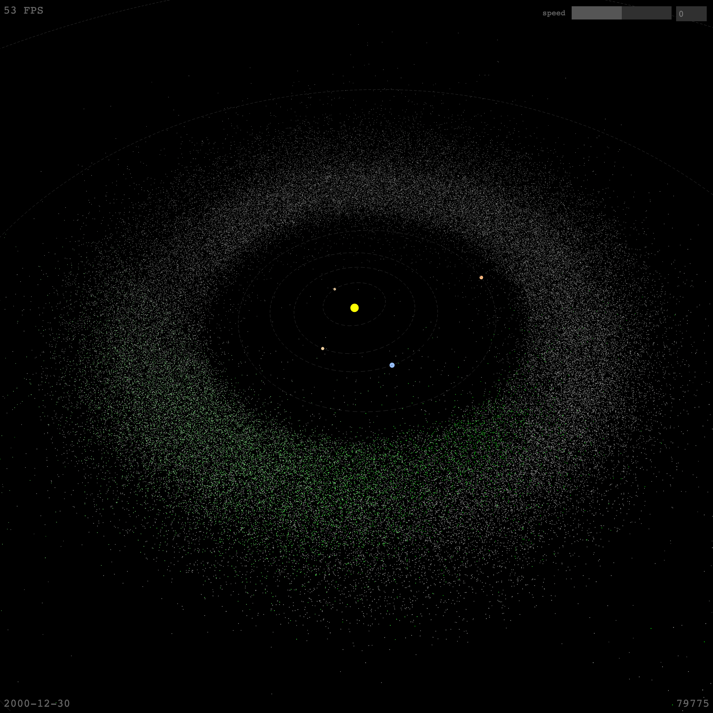

# Orrery3D

**✨ This is a 3D port of [Orrery](https://github.com/sn3p/Orrery) (2D).**

[Visualization](https://sn3p.github.io/Orrery3D) showing the orbits of [minor planets](https://en.wikipedia.org/wiki/Minor_planet) and their discovery over time.

Two datasets are used to extract the orbital elements and discovery circumstances of minor planets. The data used is maintained by [The Minor Planet Center (MPC)](https://minorplanetcenter.net/):

- [The MPC Orbit (MPCORB) Database](https://minorplanetcenter.net/iau/MPCORB.html) Database containing orbital elements of minor planets.
- [NumberedMPs.txt](https://minorplanetcenter.net/iau/lists/NumberedMPs.txt) Discovery circumstances of numbered minor planets.

## How to use

Use Node.js 24.19.0 (see `.nvmrc`). The build tools require Node.js
`^22.22.3 || ^24.15.0 || >=26.0.0`.

With nvm installed, select the project version first:

```bash
nvm install
nvm use
```

The app loads the current indexed catalogue directly from [orrery-data Pages](https://sn3p.github.io/orrery-data/). No local dataset or catalogue provisioning is needed to build or start the app. The commands below start the app on port 3000, and `npm run benchmark:serve` starts the benchmark on port 3001. See the [benchmark instructions](benchmarks/README.md) for details.

Install dependencies:

```bash
npm ci
```

Start server:

```bash
npm run serve
```

Build and bundle:

```bash
npm run build
```

Watch changes and rebuild:

```bash
npm run watch
```

Run the browser regression suite (uses installed Google Chrome):

```bash
npm test
```

To also check Firefox and WebKit:

```bash
npx playwright install firefox webkit
BROWSERS=chromium,firefox,webkit npm test
```

Tests build the real app and exercise loading, playback, discoveries, colours, camera controls, resizing, graphics recovery and errors. They also compare GPU positions against the orbital model across the 100,000-object [renderer fixture](tests/fixtures/renderer/README.md) at 12 dates, check extreme elliptical orbits with an independent solver, and compare rendered pixels in overview and close views. WebKit testing is not a substitute for testing Safari and iOS on their actual devices.

Each invocation replaces `.context/tests/report/` with fresh results and screenshots.
`run.json` records the current stage, outcome and failure stack, including build or
browser-launch failures, browser versions and the WebGL renderer; `results.json`
retains completed browser results. Per-page
JSONL logs include console messages, page errors and failed requests. Helper pages
are captured before cleanup, and still-open pages are captured on failure. The
suite deliberately exercises loading errors and diagnostics failures, so recorded
console errors alone do not determine its outcome. Check `run.json` and the exit code.

## Deployment

[GitHub Pages](https://sn3p.github.io/Orrery3D/) updates automatically after every
push or merged pull request to `master`. The [GitHub Pages workflow](.github/workflows/pages.yml)
installs locked dependencies with the Node.js version in `.nvmrc`, builds a clean
`dist/` from source, and runs the full browser suite in separate Chrome, Firefox
and WebKit jobs. Deployment requires the build and all three browser checks to
pass. Pull requests targeting `master` run the same checks without deploying.
Linux Chrome and Firefox run with a virtual display. Chrome avoids intermittent
headless surface-capture failures; Firefox's headless mode does not provide the
WebGL 2 context required by this suite.
Linux CI uses Mesa software GL (Chrome selects ANGLE's OpenGL backend). SwiftShader's
trigonometric approximations exceed the existing orbital-error bound; the suite
keeps the same shader and accuracy thresholds on the selected CI backend. Reports
retain browser-reported WebGL information, which some browsers privacy-mask.
Local runs use the browser defaults, so CI does not establish accuracy on every
graphics driver.

Each browser job retains a `browser-tests-<browser>` artifact for 14 days on
success or failure, containing the report directory and runner output. Generated
app/test bundles are excluded. Installation failures remain in the Actions step
logs; a hard cancellation may prevent the artifact upload. CI rendering is a
correctness check, not a hardware-performance benchmark.

Overlapping runs for the same branch retain up to 100 pending runs, processed in
the order they enter GitHub's concurrency queue. New runs beyond that limit are
canceled by GitHub; see the [queue documentation](https://docs.github.com/en/actions/reference/workflows-and-actions/workflow-syntax#example-queueing-multiple-pending-runs).

`dist/` is generated and ignored. No local build, generated-file commit, or push to `gh-pages` is needed to deploy.
The workflow uses the indexed selection in `catalog.config.json`. See
[catalogue delivery](docs/catalog-delivery.md) for the shared data source, mode options and optional local comparison bundles. Builds do not refresh MPC data.

To deploy `master` again, open **Actions → GitHub Pages → Run workflow**, select
`master`, or use the authenticated [GitHub CLI](https://cli.github.com/):

```bash
npm run deploy
```

This command deploys the remote `master` branch, including when run from a local
feature branch; it does not publish uncommitted local changes. Check progress in
the repository's [Actions tab](https://github.com/sn3p/Orrery3D/actions/workflows/pages.yml).

Repository setup (once, also required for forks): in **Settings → Pages**, set
**Build and deployment → Source** to **GitHub Actions**. In **Settings → Environments
→ github-pages**, allow deployments from the `master` branch. The workflow must be
merged into `master` before automatic or manual deployment is available. It uses
GitHub's built-in token; no personal access token or deploy key is needed.

## Get updated data

Normal build, serve and watch commands select the **895,910-object indexed catalogue** in `catalog.config.json`. There is no 100,000-object cap. The displayed count follows the simulation date and reaches the full discovery-dated population as time advances. App builds contain no legacy dataset or fallback. The former catalogue is isolated under [`tests/fixtures/renderer/`](tests/fixtures/renderer/README.md) for numerical and renderer regression coverage.

An [import in Orrery](https://github.com/sn3p/Orrery/pull/49) on **12 September 2026** produced **895,910 objects with matching discovery dates** from **1,563,495 orbital records**. The other **667,585** were unnumbered objects without matching discovery records in `NumberedMPs.txt`. These are dated counts that change with MPC updates; see [Orrery issue #47](https://github.com/sn3p/Orrery/issues/47) for the source verification and discovery-date limitation.

Shared catalogue processing and hosting belong to [orrery-data](https://github.com/sn3p/orrery-data). The [delivery configuration](docs/catalog-delivery.md) supports a shared `latest` URL: build only the app, then discover the current index and fetch verified chunks when opened. Reloading picks up published dataset updates without rebuilding the app. The tracked selection uses `https://sn3p.github.io/orrery-data/latest.json`; builds need no local dataset or data-host access. `whole` remains available for complete-bundle comparisons.

Larger catalogues increase download, parsing, preparation and memory costs even with GPU rendering. The benchmark's larger counts repeat the bundled records and positions; the catalogue loader exercises the real 895,910-object export, with [recorded loading and memory measurements](docs/catalog-trial-results.md). The current discovery animation requires a finite discovery date for every object.

## Rendering

Asteroid positions and discovery colours are calculated in a vertex shader within one point batch. Ordinary frames update time uniforms and the discovered draw range; they do not recalculate or upload every position in JavaScript. Planets and orbit lines still use the CPU orbital model.

Each planet caches its fixed orbital basis and ellipse scale, updating its existing position vector each frame. Changes to its orbital elements rebuild that cache. Orbit tracks reuse the same prepared calculations across their samples. The Sun and planets share sphere construction while keeping separate geometry and material ownership.

Click **[+] options** in the top-right corner to open the speed and rendering controls. The panel starts closed; click **[-] options**, click outside, or press Escape to close it without changing your settings.

Playback follows elapsed time: speed `1` means 60 simulated days per second, `0` pauses, and negative speeds reverse. The default `1.5` preserves the old pace at 60 FPS. Hidden tabs and lost graphics contexts pause playback.

Rendering starts at **1×** on every load for a softer appearance. When the display/browser pixel ratio is at least 2×, the **DPR** control offers **1×** and **2×**; 2× adds detail and graphics work. The choice lasts for the current page and resets to 1× on reload, ignoring earlier saved preferences. Below a display ratio of 2×, the control is hidden and rendering falls back to 1× (capped at the display ratio below 1×). Returning to a display ratio of at least 2× restores the current page's choice. Benchmarks use their own requested DPR.

At speed `0`, the scene renders only when the camera, date, catalogue or viewport changes, or graphics reconnect. The readout shows `0 FPS` while paused. Resuming playback excludes time spent paused or disconnected.

For maintenance: GPU attributes use Float32, so mean anomalies are refreshed from double-precision phases after a date change beyond 4096 days. This occasional O(N) update limits time-related precision loss. Only the scalar `meanAnomaly` buffer is uploaded during a refresh (4 bytes per object); eccentricity and mean motion stay in the fixed `elements` buffer. The culling sphere covers the largest full orbit, and the `position` attribute stores an orbital basis, not current coordinates; future picking must account for shader motion. Inputs must describe finite elliptical orbits, with eccentricity still below 1 when stored as Float32. Parsed catalogue objects are released after packing; typed arrays retain the orbital state and discovery dates needed for playback and graphics recovery.

Catalogue validation, stable discovery sorting and typed-array packing live in `src/js/prepareCatalogue.js`, independently of Three.js. `Orrery3D.setupAsteroids` prepares the data before constructing or replacing GPU resources. Prepared buffers carry their epoch and belong to one `Asteroids` instance; phase refreshes mutate its `meanAnomalies` buffer. Preparation retains no raw records, and errors identify the original input row. Production loading remains on the main thread.

Run `npm run benchmark` to measure the current renderer as asteroid count grows; see the [benchmark instructions](benchmarks/README.md). Timings depend on browser, GPU, display pacing and power settings. Larger benchmark counts repeat bundled records. Tests validate against this project's orbital model, not astronomical accuracy; new catalogue extremes, mobile GPUs and extreme zoom need separate verification.

## Screenshot


