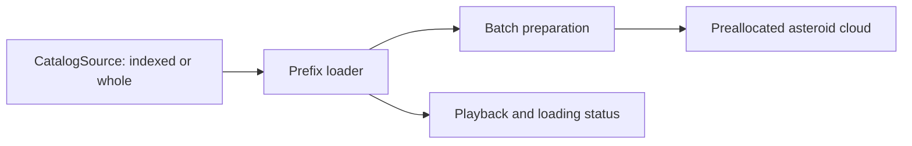

# Proposal: catalog loading adapters for Orrery3D

> Trial-era record: the later rollout removes the historical app mode and fallback.
> Current selection and delivery are documented in [catalogue delivery](../catalog-delivery.md).

**Revision 2 — approved for implementation, 13 September 2026.** Incorporates the supplied [review](catalog-loading-adapters-review.md); see the [response to each finding](catalog-loading-adapters-review-response.md). The user approved these implementation choices and provisional budgets after reviewing this revision. The local trial is now implemented; see [usage and verification](../catalog-trial.md). A production switch remains separately scoped.

## Recommended design

Use **one source implementation with indexed and whole-file modes**, one sequential prefix loader, and the existing asteroid shader. Start with main-thread batch preparation and preallocated buffers. Add a worker only if measured stalls justify it.

This removes separate adapter modules, general interval tracking, adaptive prefetch and buffer-growth machinery from the first trial. It preserves the approved [contract v1](https://github.com/sn3p/orrery-data/blob/f6f4a1d4e807362417c74ecbd2b74ce73306d41d/docs/consumer-contract.md), its fixture semantics and a small whole-file comparison mode.

The public app keeps its historical 100k catalog during the trial. Select experimental modes through development/test configuration. New controls, undated objects, a service backend and public rollout remain separate decisions.

## Expected benefit

The pinned catalog contains 895,910 dated objects: 118.82 MB decoded or 34.20 MB stored gzip. Its indexed representation has 114 chunks capped at 1 MiB decoded, totaling 34.26 MB stored gzip, plus a 265,372-byte decoded index. Values and discovery order are unchanged. [Producer measurements](https://github.com/sn3p/orrery-data/blob/f6f4a1d4e807362417c74ecbd2b74ce73306d41d/docs/indexed-delivery.md).

| Demand from February 1, 1980 | Required compressed chunks |
| --- | ---: |
| Initial population | 0.62 MB |
| 60 seconds at default speed | 0.93 MB |
| 120 seconds at default speed | 24.43 MB |
| 180 seconds at default speed | 34.26 MB |
| 30 seconds at maximum speed | 34.16 MB |

These are projections without buffering, index, lookahead or HTTP overhead. The proposed lookahead increases short-session bytes; measure that increase. Recent-date starts and full playback still need almost everything.

Pages has a 1 GB published-site limit and a **soft** 100 GB/month bandwidth limit. At 34.2 MB per complete download, roughly 2,900 such downloads alone approach that allowance; this is bandwidth arithmetic, not a hard visitor cap. Reducing short-visit transfer is an explicit trial objective. [Pages limits](https://docs.github.com/en/pages/getting-started-with-github-pages/github-pages-limits).

## Small runtime boundary



```js
const source = await CatalogSource.open(pin, { mode, signal });
source.info;                            // verified, immutable index
source.sourceId;                        // exact index SHA-256
source.countThrough(julianDay);
source.read({ start, end }, { signal }); // ordered batch/complete events
source.close();                         // idempotent
```

`mode` is consumer configuration; it does not alter the producer pin or metadata. Indexed mode reads `index.chunks`. Whole mode internally treats `index.full` as one file spanning the selected population. Both use the same verification and range-reading helpers, data and downstream loader. An empty profile needs no payload read.

Keep the contract's nine named numeric fields, finite Julian-day inputs, inclusive `disc <= T`, exact half-open ranges and event identities. Validate index structure/versions before use; verify decoded file hashes, records, counts and date agreement before yielding. A failed/cancelled read emits no successful completion. Opening and each read have independent cancellation scopes; close aborts active work and rejects later reads.

The whole mode remains a useful controlled baseline. Earlier full-file observations establish a concern but used different verification, timing and graphics settings. No second cache framework or module hierarchy is needed. Keep the historical 100k path as a separate regression control without invented producer provenance.

## Sequential prefix loader

Retain a single committed population `[0, committedCount)`. A complete scene at T requires `countThrough(T) <= committedCount` **and** valid graphics commitment.

- Issue one logical forward read at a time. Allow at most two outstanding file-processing slots, including fetch, verification, decoded/prepared results awaiting commitment. Prepare/commit batches in ordinal order and release transient raw records afterward.
- Two requests can finish out of order. Hold the later result until its predecessor commits; never advance the prefix across a hole. Ignore already committed duplicates. No interval tree is required.
- Prioritize the initial population. After its first complete render, keep at most three chunks beyond the current requirement as fixed lookahead. Pause/hidden states stop unnecessary lookahead. Explicit initial/date demand remains distinct from speculative work.
- Advance simulation only to dates whose complete population is committed. An equal-date split waits for the count index's complete date total. Buffer without changing the selected speed; reset the clock before resuming so waiting time is not replayed.
- Reverse uses retained prefix data. Later starts/jumps request the missing prefix before presenting the requested date as complete. They still need loading/error tests.
- Retain one loader generation counter and disposal/source-close checks. They reject obsolete async results after reset, replacement or disposal. Source replacement is tested internally; no public selector is needed.

The adapter still supports the contract's independent overlapping reads even though normal playback has one reader. Use simple read-local cancellation; shared download deduplication is optional. A small bounded processing queue is sufficient. Cross-read cancellation and stale-result fixtures remain required.

## Fixed buffers and measured preparation

Preallocate for the selected count as the **first trial strategy**, with honest accounting:

| Storage for 895,910 objects | Bytes |
| --- | ---: |
| CPU attribute arrays, 40 bytes/object | 35,836,400 |
| Float64 phases and dates, 24 bytes/object | 21,501,840 |
| GPU attribute storage, 40 bytes/object | 35,836,400 |
| Combined nominal CPU/GPU data | **93,174,640** |

These allocations exclude the rest of the app and temporary hash/text/record buffers. Preallocation offers no small initial graphics footprint. Its benefit is simpler storage and avoiding repeated growth/copying.

Three.js initially uploads the **entire** attribute array with `bufferData`; update ranges apply to later uploads. Count this first upload and graphics-restoration cost in startup/stall measurements. `setDrawRange` limits rendering, not allocation or initial upload. If the fixed footprint fails the budgets, document that result before choosing a different storage strategy.

Prepare and commit each bounded batch synchronously using the cloud's current epoch. Reuse existing finite-value, Float32 and high-eccentricity checks. Update only newly filled component ranges, grow the bounding sphere, and constrain discovery searches and phase-refresh loops to committed rows. Never draw uninitialized capacity. Retain verified prepared arrays for reverse movement and context restoration; raw chunk objects should become collectible.

Start without a worker. A 1 MiB file bounds work but does not prove a frame-time target on every device. If attributable parsing/preparation stalls exceed the provisional budget, move that work behind the existing pure preparation seam. Any later async batch carries its epoch and generation; rephase its range if the cloud epoch changed before commitment.

## Pages provisioning and immutable paths

Define provisioning in stage 1 so the trial exercises deployable paths:

1. A small Node provisioner reads a trusted pin and obtains the original bundle from a local directory initially, or an immutable download URL when one exists. Verify the index and every staged artifact against it. Preserve notices/provenance and original identities.
2. Stage inputs in an ignored cache outside `dist/`, reusable by app development, fixture tests and benchmarks.
3. Run webpack with `--output-clean`, then copy the verified data into `dist/data/delivery-v1-<index-hash>/`. Verify the final staged files before creating the Pages artifact. Test this assembly locally without deploying it.
4. Use the same pin and assembly sequence in the future Pages job. Untrack generated `dist/` only with verified source-build replacement across setup, tests, benchmarks and CI. Keep the historical catalog control.

Do not commit the 118.8 MB full file: it exceeds GitHub's regular Git 100 MiB/file limit. Small chunks individually fit that limit, but generated data still belongs outside source history. CI generation/download also allows a whole file to be deployed without committing it; the Git limit alone does not decide the runtime adapter. [Git file limits](https://docs.github.com/en/repositories/working-with-files/managing-large-files/about-large-files-on-github).

Choose plain `.json` URLs for runtime. Let HTTP gzip be decoded by `fetch`, then hash decoded bytes. No explicit `.gz` runtime branch is needed. Keep the original index and its gzip/provenance descriptors intact; preserve referenced assets when staging a complete bundle. Do not silently strip files or rewrite a pinned descriptor to invent a smaller distribution contract.

The historical live catalog was verified gzip-compressed on Pages. Actual new-chunk/index compression and bytes remain a rollout check. Versioned directories prevent content from two pins sharing a URL; they do not guarantee availability of old files after deployment. Define prior-version retention and rollback before publication, and fail clearly if an old page requests an unavailable chunk.

No public indexed release URL exists. **Proposed eventual archive:** an immutable `orrery-data` release; its creation is separate producer work. Local fixture/full-bundle provisioning and asset assembly can proceed now. Production CI retrieval and hosted verification wait for a real source; there is no placeholder release dependency.

## Stages and acceptance

| Stage | Deliverable |
| --- | --- |
| 1. Provisioning and source | Local staging/clean-build assembly, pin validation, one source class with both modes, complete Node fixture/request coverage. |
| 2. Prefix and graphics | Fixed lookahead, bounded processing, preallocation, buffering and actual app lifecycle tests; main-thread preparation first. |
| 3. Measurements | Same-pin native/throttled Chrome comparisons, full playback and late starts; record limitations and any failed budget. |
| 4. Recommendation | Retain current default or recommend later indexed rollout. Public source, hosted checks and production switch remain separately scoped. |

Use all committed request/error/lifecycle vectors through the real source and loader. Fast Node tests cover transport, ranges, hashes and cancellation. Browser fixtures cover boot, buffering/clock reset, ties, reverse, reset/stale results, retry, reload, disposal, graphics recovery and rendered desktop/narrow status behavior. A single organized test helper can cover many scenarios; one happy-path test cannot replace them.

Keep the existing Chrome/Firefox/WebKit regression gates and focused orbital/phase accuracy checks. Start performance exploration with one run per mode on native and 10 Mbps/100 ms conditions. Before a favorable trial recommendation, repeat the primary target enough to establish consistency (initially three runs); do not launch a large browser/network performance matrix. Perform the required independent integration review for this cross-cutting loader/renderer change.

**Approved provisional trial targets**, using cold-cache desktop Chrome, the explicit February 1980 date, 10 Mbps/100 ms, 1280×800 at effective DPR 1:

| Measure | Target / reporting rule |
| --- | --- |
| Complete initial asteroid scene | ≤2 seconds from navigation through first correct draw; include index and first GPU upload. |
| Main-thread work | No catalog-loading task >50 ms, including preparation/commit; also report the largest page-wide task. |
| Retained CPU catalog/app memory after full commitment | ≤150 MB of JS heap plus ArrayBuffer backing storage without double counting, under a recorded measurement method. Report GPU storage separately. |
| Bandwidth | Record actual bytes at 30/60/120 seconds and full run, including lookahead. Short-visit reduction is a Pages acceptance consideration. |
| Other costs | Record peak memory, buffering duration and sustained rendering. A retained-heap number alone does not establish device safety. |

Report hardware, browser versions, code/data pins, timing boundaries, cache behavior and metric limitations. Desktop throttling does not certify physical phones. Treat the targets as hypotheses, not achieved results; explain any proposed adjustment rather than moving a threshold silently.

## Base, boundaries and references

PR28 is now **merged**. Implementation should start from current appropriate master, observed at `91e81c59f2339adaf0feb1f39e32471eba6e4a39`, preserving the new options/DPR behavior. Implementation advanced this workspace to that master before changing the app. Orrery's own integration is deferred while Orrery3D goes first; no result transfers automatically between apps.

Keep 1 MiB chunks for this pinned trial. Evaluate another size only if request overhead or stalls demonstrate a need; record its new index pin. Unknown-date display, date controls, binary formats, server operation and broader cleanup remain deferred.

- [Producer handoff and fixtures](https://github.com/sn3p/orrery-data/blob/f6f4a1d4e807362417c74ecbd2b74ce73306d41d/docs/consumer-handoff.md)
- [Experimental contract v1](https://github.com/sn3p/orrery-data/blob/f6f4a1d4e807362417c74ecbd2b74ce73306d41d/docs/consumer-contract.md)
- Catalog ID: `export-v1-b0d9911194ffdc6d14bdc2e90565f83ffe2740a0b72b0297ee997569716316bd`.
- Index SHA-256: `bf4252e0e20b6db07df83a2d87f731788235067fbcd2d3a78c98f92083880db2` (265,372 decoded bytes).

The strategy and provisional budgets were approved for this trial. The proposed producer archive destination is not an implemented release. Passing the local trial recommends a next step; it does not itself authorize a production catalog switch.
